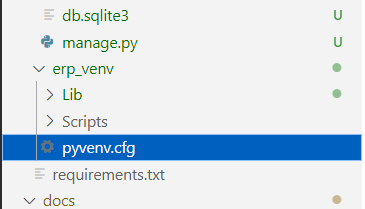

# P01 Task1之环境安装

## 一、安装 Python（以windows平台为例）

1、下载并安装

打开https://www.python.org/downloads/windows/，根据windows是64位还是32位，选择相应python版本下载,并根据提示安装即可。

2、在环境变量中添加Python目录

（1）方法一：在命令提示框中(cmd) : 输入 path=%path%; x  （x是python安装路径，比如安装在d盘根目录下，则x就写成d:\Python）

（2）方法二：右键点击"计算机"->"属性"->"高级系统设置"->选择"系统变量"下面"Path"->双击path->在"Path"行添加python安装路径即可(比如d:\Python)。 

## 二、创建虚拟环境

虚拟环境是把物理机里python解释器复制到虚拟环境，近似克隆出一套python环境。在构建Django项目之前，项目所需要第三方包通过虚拟环境的pip来下载。项目构建完毕，随着虚拟环境退出，第三方包也跟着解散，从而维护了物理机的python环境的干净无染。同时，虚拟环境可以帮助你隔离不同项目的依赖库，避免项目间的库版本冲突。

1. 创建虚拟环境

    `python -m venv erp_venv`       
    
    这里的erp_venv 为创建者根据自己喜好为Python虚拟环境起的名字。也就是说将Python 虚拟环境安装在当前所在目录下的 `erp_venv` 文件夹中。

2. 激活虚拟环境

    进入虚拟环境目录 `cd：.\erp_venv`

    > `.\Scripts\activate`

3. 退出虚拟环境

    `deactivate`

## 三、项目依赖包安装
     
在虚拟环境激活状态下，进行项目依赖包的安装。这里介绍量中安装方法。

1、方法一

    将依赖包依次写入记事本，形成requirement.txt文件,运用pip命令在该文件路径下进行安装。
         `pip install -r requirements.txt -i https://pypi.tuna.tsinghua.edu.cn/simple`

2、方法二
    
    也可以将requirement.txt手动输入的方式，运用pip进行依赖包的逐个安装。如
     
 * 安装 Django

   `pip install django`  

 * 安装 DRF

    `pip install djangorestframework`  
DRF 是一个基于 Django 的强大而灵活的 RESTful 框架，它提供了许多工具和库，可帮助你快速开发基于 RESTful API 的 web 应用程序。

 * 安装 Django-Filter

    `pip install django-filter`

Django-Filter 是一个基于 Django 的库，它提供了一种简单、灵活的方式来过滤 Django 模型的查询集。Django-Filter 的 API 允许开发者使用简单的查询表达式，构建和应用复杂的过滤器，从而在查询集中选择和排除数据。
介绍：[Integration with DRF — django-filter 23.2 documentation](https://django-filter.readthedocs.io/en/stable/guide/rest_framework.html#drf-integration)

 * 安装 Django Spectacular

    `pip install drf_spectacular`  
DRF Spectacular 是 DRF 的 OpenAPI 规范工具。它可以自动构建和生成 OpenAPI 规范文档，并提供方便的 API 测试工具，使你能够更加轻松地创建、测试和维护 RESTful API。同时，它也支持集成 Django Filter，允许你通过 URL 参数过滤查询数据。Django-Filter 通过与 DRF Spectacular 的集成，支持 OpenAPI 规范表述的数据过滤和查询，提供了更加优雅的 API 规范方案。

 * 安装 debug_toolbar 库

     `pip install django-debug-toolbar`
    
 * 安装django_extensions 

    `pip install django_extensions`

    

## 四、学习要求
    
   1. 能够熟练安装pyhton，创建虚拟环境，并在虚拟环境激活情况下安装所需依赖包。（必做题）

   2. 在操作过程中出现的问题和解决办法等，若能整理并提交分享到学习群中，感谢不尽。助教会进行梳理和总结，为本项目的教材的进一步完善做出贡献。（选做，不强求）

## 五、常见的报错及解决

1. 问题：打开虚拟环境使用`python manage.py makemigrations`显示`No Python at C:\Users\78523\AppData\Local\Programs\Python\Python39\python.exe'`  
  
    
    
    解决措施： 可使用requirements.txt选择你本地的python来一键创建虚拟环境 

`pip install -r requirements.txt -i https://pypi.tuna.tsinghua.edu.cn/simple`    （后面网址为清华源配置）

    
    

- 之后将其中的`.venv\pyvenv.cfg`复制到`code\erp_venv\pyvenv.cfg`中即可解决。

    

2. 问题：pip install -r requirements.txt -i https://pypi.tuna.tsinghua.edu.cn/simple`  非常缓慢
   
   解决措施：可以将改变清华园源为阿里源等，或者重新启动电脑。

　　‍
