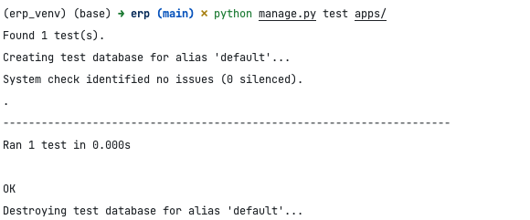

# Django单元测试

本教程将指导您如何为 Django 项目编写单元测试。我们将对模型、视图、和序列化器进行测试。

Python 一般使用标准库 `unittest` 提供单元测试，django 拓展了单元测试，提供了一系列类，用于不同的测试场合。其中最常用到的就是 `django.test.TestCase` 类，这个类和 Python 标准库的 `unittest.TestCase` 类似，只是拓展了以下功能：
- 提供了一个 client 属性，这个 client 是 Client 的实例。可以把 Client 看做一个发起 HTTP 请求的功能库（类似于 requests），这样我们可以方便地使用这个类测试视图函数。
- 运行测试前自动创建数据库，测试运行完毕后自动销毁数据库。我们肯定不希望自动生成的测试数据影响到真实的数据。

让我们来先小试牛刀一下。
测试写在 `tests.py` 里（应用创建时就会自动创建这个文件），首先来个加法测试，用于验证测试功能是否正常，在 `tests.py` 文件写入如下代码：
```
from django.test import TestCase


class AddTestCase(TestCase):
    def test_add(self):
        self.assertEqual(1 + 1, 2)
```

使用 manage.py 的 test 命令将自动发现 django 应用下的 tests 文件或者模块，并且自动执行以 test_ 开头的方法。运行：`python manage.py test apps/` ，其中`apps/`为自己的应用根目录，django 会自动查找apps目录下的所有单元测试文件。



表明我们的测试运行成功。

由于测试代码过多，把全部测试逻辑一股脑塞入 `tests.py`，这个模块就会变得十分臃肿，不利于维护，所以我们把 `tests.py `文件升级为一个包，不同的单元测试写到包下对应的模块中，这样便于模块化地维护和管理。

删除 `tests.py` 文件，然后在应用下创建一个 `tests` 包，再创建各个单元测试模块：
```
apps\
  erp_test\
    tests\
      __init__.py
      test_models.py
      test_views.py
      test_serializers.py
```
> **注意**
> tests 包中的各个模块必须以 test_ 开头，否则 django 无法发现这些测试文件的存在，从而不会运行里面的测试用例。


django 应用的单元测试包括：

- 测试 model，model 的方法是否返回了预期的数据，对数据库的操作是否正确。
- 测试序列化器
- 测试视图，针对特定类型的请求，是否返回了预期的响应
- 其它的一些辅助方法或者类等

接下来我们就逐一地来测试上述内容。

## 测试模型
`erp/apps/erp_test/tests/test_models.py`

```python
from django.test import TestCase
from apps.erp_test.models import Goods, GoodsCategory


class GoodsCategoryModelTest(TestCase):
    @classmethod
    def setUpTestData(cls):
        # 设置测试数据
        GoodsCategory.objects.create(name='电子产品')

    def test_name_label(self):
        category = GoodsCategory.objects.get(id=1)
        field_label = category._meta.get_field('name').verbose_name
        self.assertEqual(field_label, '分类名称')

    def test_name_max_length(self):
        category = GoodsCategory.objects.get(id=1)
        max_length = category._meta.get_field('name').max_length
        self.assertEqual(max_length, 64)


class GoodsModelTest(TestCase):
    @classmethod
    def setUpTestData(cls):
        # 创建分类
        category = GoodsCategory.objects.create(name='电子产品')
        # 创建商品
        Goods.objects.create(category=category, number='001', name='手机')

    def test_number_label(self):
        goods = Goods.objects.get(id=1)
        field_label = goods._meta.get_field('number').verbose_name
        self.assertEqual(field_label, '产品编号')

    def test_number_max_length(self):
        goods = Goods.objects.get(id=1)
        max_length = goods._meta.get_field('number').max_length
        self.assertEqual(max_length, 32)
```
在 `GoodsCategoryModelTest` 类中，我们测试 `GoodsCategory` 模型的不同方面。

- `setUpTestData` 方法：这是一个类方法（使用 @classmethod 装饰器），在测试类中只运行一次。我们在这里创建了测试用的 GoodsCategory 实例。这个方法是为所有测试方法准备数据的好地方。

- `test_name_label` 方法：这个测试确保 name 字段的标签（或者说友好名称）是正确的。我们从模型元数据中获取字段标签，并将其与预期的标签进行比较。

- `test_name_max_length` 方法：这个测试检查 name 字段的最大长度是否如我们预期。同样，我们从模型元数据中获取这个信息。

## 测试序列化器
`erp/apps/erp_test/tests/test_serializers.py`
```python
from django.test import TestCase

from apps.erp_test.models import GoodsCategory, Goods
from apps.erp_test.serializer import GoodsSerializer


class GoodsSerializerTest(TestCase):
    @classmethod
    def setUpTestData(cls):
        category = GoodsCategory.objects.create(name='电子产品')
        Goods.objects.create(category=category, number='001', name='手机')

    def test_goods_serialization(self):
        goods = Goods.objects.get(number='001')
        serializer = GoodsSerializer(goods)
        data = serializer.data
        self.assertEqual(data['name'], '手机')

```
`GoodsSerializerTest` 类用于测试 GoodsSerializer 序列化器。

- `setUpTestData` 方法：我们在这里创建一个 GoodsCategory 和一个 Goods 实例，用于后续的序列化测试。

- `test_goods_serialization` 方法：这个测试检查 Goods 实例是否能被正确序列化。我们创建一个 Goods 实例的序列化器，并检查返回的数据是否符合预期。

## 测试视图
`erp/apps/erp_test/tests/test_views.py`

```python
from rest_framework.test import APITestCase
from rest_framework import status
from apps.erp_test.models import GoodsCategory


class GoodsCategoryViewSetTest(APITestCase):
    @classmethod
    def setUpTestData(cls):
        GoodsCategory.objects.create(name='电子产品')

    def test_get_categories(self):
        response = self.client.get('/GoodsCategory/')
        self.assertEqual(response.status_code, status.HTTP_200_OK)
        self.assertEqual(len(response.data), 1)


class GetGoodsTest(APITestCase):
    def test_get_goods(self):
        response = self.client.get('/getgoods/')
        self.assertEqual(response.status_code, status.HTTP_200_OK)

```

`GoodsCategoryViewSetTest` 类用于测试 GoodsCategoryViewSet 视图集。

- `setUpTestData` 方法：同样是一个类方法，用于创建测试数据。在这个例子中，我们创建了一个 GoodsCategory 实例。

- `test_get_categories` 方法：这个测试模拟一个 GET 请求到 GoodsCategoryViewSet。我们检查响应的状态码是否为 200（HTTP OK），以及响应数据中的类别数量是否正确。

## 高阶测试（扩展）

### 1. Mocking 外部服务（不适用于本项目的代码，可自己做扩展）
在测试中，经常需要模拟（Mock）外部服务或复杂的内部逻辑，以确保测试的独立性和效率。例如，如果您的视图依赖于外部的 API 调用或复杂的数据库操作，您可以使用 mock 来模拟这些操作的返回值。

下面提供一个具体的例子，展示如何在 Django 测试中使用 Mocking 来模拟外部服务。

假设你的 Django 项目中有一个函数 `fetch_product_data`，它调用了外部的 API 来获取产品数据。我们将使用 `unittest.mock` 模块中的 `patch` 函数来模拟这个外部 API 调用。

假设有如下函数：

```python
# services.py

import requests

def fetch_product_data(product_id):
    response = requests.get(f"https://external.api/products/{product_id}")
    return response.json()
```

这个函数接受一个 `product_id`，并从外部 API 获取产品数据。

**Mocking 外部 API 调用**

在你的测试文件中，你可以使用 `patch` 来模拟 `requests.get` 方法，以防止实际的外部 API 调用。

```python
# tests.py

from django.test import TestCase
from unittest.mock import patch
from .services import fetch_product_data

class ExternalAPITest(TestCase):
    @patch('your_app.services.requests.get')
    def test_fetch_product_data(self, mock_get):
        # 设置模拟 API 返回值
        mock_get.return_value.json.return_value = {
            "id": "123",
            "name": "Test Product",
            "price": 29.99
        }

        # 调用需要测试的函数
        product_data = fetch_product_data("123")

        # 断言测试结果
        self.assertEqual(product_data, {
            "id": "123",
            "name": "Test Product",
            "price": 29.99
        })

        # 确认 mock_get 被正确调用
        mock_get.assert_called_with("https://external.api/products/123")
```

**代码解释**

- `@patch('your_app.services.requests.get')`：这行代码使用 `patch` 装饰器来模拟 `requests.get` 方法。`your_app.services` 应该替换为包含 `fetch_product_data` 函数的实际模块路径。
- `mock_get` 参数：这是 `patch` 装饰器创建的模拟对象，它会替换 `requests.get` 方法。
- `mock_get.return_value.json.return_value`：这里我们设置了模拟`requests.get` 方法的返回值。首先设置 `return_value` 为一个响应对象（模拟的），然后进一步设置该响应对象的 `json` 方法的 `return_value`，以便当 `fetch_product_data` 函数尝试解析 JSON 时，它会收到我们预设的数据。
- `product_data = fetch_product_data("123")`：调用我们的函数，此时函数内部的 `requests.get` 已被模拟对象替换，不会发起真正的网络请求。
- 最后，使用断言来验证函数返回的数据是否符合预期，并且确认 `mock_get` 方法是否被正确调用，以及其调用参数是否正确。

这个示例展示了如何在 Django 测试中使用 Mock 来模拟外部服务或函数调用，从而使测试更加独立和可控。

### 2. 完整的请求和响应流程测试（不适用于本项目的代码，可自己做扩展）
对于视图测试，除了基本的 GET 和 POST 请求，还应该测试完整的请求和响应流程，包括请求头、身份验证、权限检查等。

假设 `GetGoods` 视图需要用户认证才能访问，我们将测试未认证和已认证两种情况的请求。

编写测试代码：

```python
from rest_framework.test import APITestCase, APIClient
from rest_framework import status
from django.urls import reverse
from .models import Goods, GoodsCategory
from rest_framework.authtoken.models import Token
from django.contrib.auth.models import User

class GetGoodsTest(APITestCase):

    def setUp(self):
        # 创建用户和认证 Token
        self.user = User.objects.create_user(username='testuser', password='12345')
        self.token = Token.objects.create(user=self.user)
        self.client = APIClient()

        # 创建测试数据
        category = GoodsCategory.objects.create(name='测试分类')
        Goods.objects.create(category=category, number='001', name='测试商品')

    def test_get_goods_unauthenticated(self):
        # 测试未认证用户访问
        response = self.client.get(reverse('get_goods_url_name'))  # 确保使用正确的 URL 名称
        self.assertEqual(response.status_code, status.HTTP_401_UNAUTHORIZED)

    def test_get_goods_authenticated(self):
        # 设置认证 Token
        self.client.credentials(HTTP_AUTHORIZATION='Token ' + self.token.key)

        # 测试已认证用户访问
        response = self.client.get(reverse('get_goods_url_name'))  # 确保使用正确的 URL 名称
        self.assertEqual(response.status_code, status.HTTP_200_OK)
        self.assertEqual(response.data[0]['name'], '测试商品')
```

**代码解释**

- **setUp 方法**：这个方法在每个测试方法运行之前运行。它用于设置测试环境，包括创建测试用户、认证 Token 和测试数据。

- **test_get_goods_unauthenticated**：这个方法测试未经认证的用户访问 `GetGoods` 视图的情况。预期的响应状态码应该是 401 未授权。

- **test_get_goods_authenticated**：这个方法测试已认证用户访问视图的情况。我们使用 `self.client.credentials` 方法来设置请求的认证头。预期的响应状态码是 200 OK，且返回数据中应包含我们创建的商品信息。

- **reverse('get_goods_url_name')**：使用 Django 的 `reverse` 函数来获取 `GetGoods` 视图的 URL。你需要将 `'get_goods_url_name'` 替换为你的项目中 `GetGoods` 视图对应的 URL 名称。

**注意事项**

- 确保你的 `GetGoods` 视图和 URL 正确配置了认证机制，如 Token 认证。
- 在测试数据库中创建的数据（如商品和分类）仅在测试过程中存在，测试结束后会被自动清除。
- 如果 `GetGoods` 视图有其他特殊逻辑（如权限检查、复杂查询等），也应在测试中覆盖这些情况。

通过以上测试，你可以确保 `GetGoods` 视图在不同认证状态下的行为符合预期，从而保证了代码的可靠性和安全性。


### 3. 集成测试（适用于本项目的代码）
集成测试通常设计多个组件（如模型、视图、路由等）的协同工作。以下是一个针对您提供的 Django 代码的集成测试示例，我们将在这个测试中模拟一个完整的用户请求流程：创建商品类别、添加商品，然后通过 API 检索这些商品。

**示例：测试商品类别和商品的创建及检索**

这个测试包括以下步骤：

1. 创建一个商品类别。
2. 添加属于该类别的商品。
3. 通过 API 检索并验证商品数据。

测试代码如下：

```python
# tests.py

from django.test import TestCase
from rest_framework.test import APIClient
from rest_framework import status
from django.urls import reverse
from apps.erp_test.models import Goods, GoodsCategory

class GoodsIntegrationTest(TestCase):

    def setUp(self):
        # 创建客户端实例
        self.client = APIClient()

        # 创建商品类别
        self.category = GoodsCategory.objects.create(name='电子产品')

        # 添加商品数据
        self.goods = Goods.objects.create(
            category=self.category, 
            number='001', 
            name='智能手机', 
            purchase_price=500, 
            retail_price=800
        )

    def test_goods_retrieval(self):
        # 获取商品列表的 URL
        url = reverse('goods-list')  # 确保这里的 URL 名称与你的 urls.py 中的名称匹配

        # 发送 GET 请求
        response = self.client.get(url)

        # 检查响应状态码
        self.assertEqual(response.status_code, status.HTTP_200_OK)

        # 验证响应数据
        self.assertEqual(len(response.data), 1)
        self.assertEqual(response.data[0]['name'], '智能手机')
        self.assertEqual(response.data[0]['purchase_price'], 500)
        self.assertEqual(response.data[0]['retail_price'], 800)
```

**代码解释**

- `setUp` 方法：在每个测试方法之前执行，用于设置测试环境。在这里，我们创建了一个商品类别和一个商品。
- `test_goods_retrieval` 方法：测试通过 API 获取商品列表。我们使用 `reverse` 函数获取 URL 并发送 GET 请求，然后验证响应状态码和数据。

**注意**

- 确保 `reverse('goods-list')` 中的 `'goods-list'` 是您的项目中用于检索商品列表的 URL 名称。即`urls.py`中 `path('getgoods/', GetGoods.as_view(), name='goods-list')` 的 `name` 参数值。
- 这个测试集成了模型的创建和视图的响应，适用于验证整个应用的工作流程。

这个示例展示了一个基本的集成测试流程，您可以根据项目的具体需求扩展或修改这个测试。集成测试是验证应用各个部分如何一起工作的重要部分，它有助于捕捉单元测试可能遗漏的问题，如组件间的交互问题或整体流程的问题。