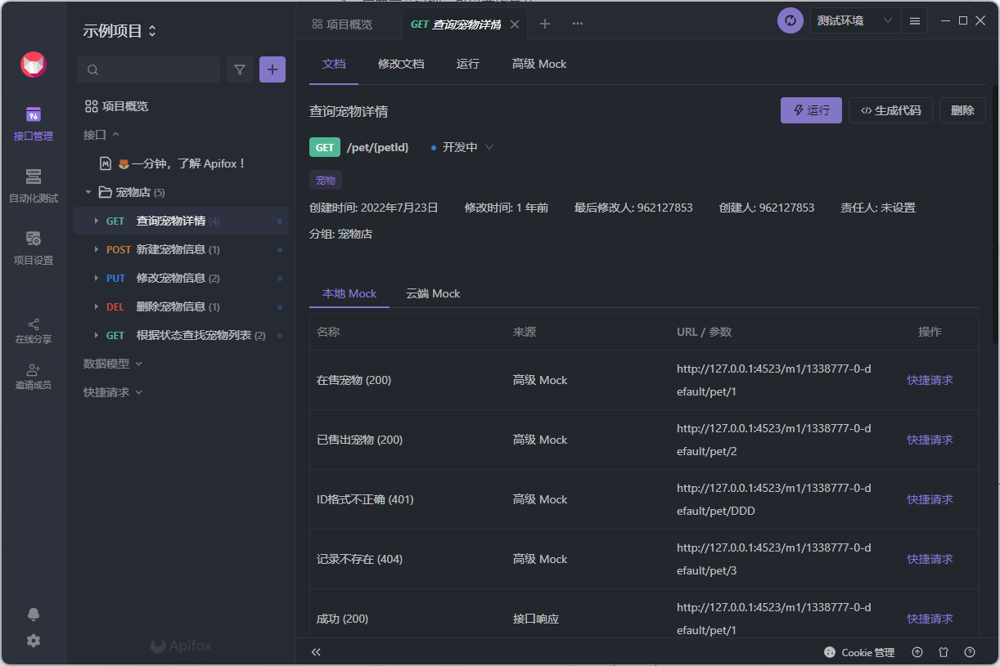
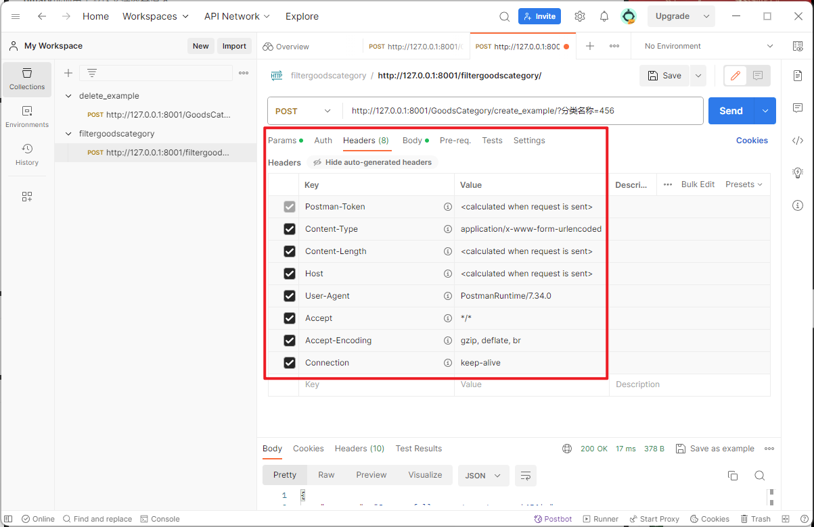

# P12 Postman 以及国内API调试工具介绍

调试工具是用于开发人员设计、测试和验证软件程序或应用程序的工具。它们可用于检查代码、执行单元测试、模拟网络请求和检测错误。API调试工具专门用于处理应用程序编程接口（API），帮助开发人员构建、测试和调试API端点，确保其正确性和稳定性。

## 国内外API调试工具介绍

**Postman：** Postman是一个流行的用于构建、测试和调试API的协作平台。它拥有直观的用户界面，允许用户轻松设置请求参数、构建请求、检查响应，并与团队共享API。Postman支持多种常见的HTTP请求类型，如GET、POST、PUT、DELETE等，还允许用户设置请求头、参数、身份验证信息等。此外，Postman还提供了对测试集合的支持，允许用户编写测试脚本来验证API的行为。[点我下载](https://www.postman.com/downloads/) 

**ApiPost：**  作为一个专注于为中国用户提供API测试的工具，ApiPost专注于创建API接口，使用户能够快速进行接口测试和调试。它提供直观的用户界面和丰富的功能，支持各种常见的HTTP请求方式，并允许用户设置请求参数、编写脚本进行测试等。[点我下载](https://www.apipost.cn/)

**Apifox：** Apifox 是另一个面向API设计和调试的在线工具，提供了用户友好的界面，用于设计和测试API，以及创建文档。它有类似于Swagger的API设计界面，可以帮助用户设计和编辑API，包括参数、路径等。[点我下载](https://apifox.com/)

## Postman介绍

如果报以下这个错误，证明POST请求的URL结尾缺少斜杠 `/`，需要添加斜杠

>RuntimeError: You called this URL via POST, but the URL doesn't end in a slash and you have APPEND_SLASH set. Django can't redirect to the slash URL while maintaining POST data. Change your form to point to 127.0.0.1:8001/GoodsCategory/insertgoodscategory/ (note the trailing slash), or set APPEND_SLASH=False in your Django settings.

在postman中填写请求信息，如下图：

有些请求参数必须都正确填写才能通过请求。

### 请求头字段解读

**Postman-Token** ：发送请求时生成的令牌 (token)，每次请求都会生成一个新的令牌， 令牌可防止用户多次发送相同的请求，因此服务器可以验证令牌并识别请求是否被篡改。
**Content-Type** ：指定发送到服务器的实体主体的媒体类型。

- `application/x-www-form-urlencoded` 是其中一种 Content-Type 类型，通常用于将表单数据编码为键/值对的格式，只支持普通的文本内容，并发送到服务器。使用 `x-www-form-urlencoded` 请求体会被编码成 `name=%E5%BC%A0%E4%B8%89&remark=18`。
- `multipart/form-data` 会把表单内容分成多个部分，都支持不同的Content-Type，比如图片、音频、视频等。

**Content-Length** ：用于指定请求中实体主体的长度（以字节为单位）。  

**Host** ：指定了服务器的主机名和端口号，即请求要发送到的目标服务器的网络位置。  

**User-Agent** ：用于识别发起请求的客户端应用程序或设备的信息。在这种情况下，`User-Agent: PostmanRuntime/7.34.0` 表明请求是由 Postman 软件的运行时环境发出的。  

**Accept** ：表示客户端（浏览器或应用程序）愿意接受任何类型的响应。`*/*` 通配符表示接受所有类型的内容，这包括文本、图像、音频、视频等。  

**Accept-Encoding** ：它用于告知服务器客户端所支持的内容编码方式。

- `gzip` 是一种数据压缩格式，通常可以减少服务器传输数据的大小，提高传输速度。
- `deflate` 也是一种数据压缩格式，与 gzip 类似，用于压缩数据以便更有效地传输。
- `br` 是 Brotli 压缩算法的意思，是一种压缩方式，通常提供比 gzip 和 deflate 更好的压缩率。

**Connection** ：用于控制网络连接的行为。 `Connection: keep-alive`。这个头部字段表示客户端希望与服务器建立持久连接，即在完成当前请求后保持连接打开，以便进行进一步的请求和响应。

这些请求头字段一般不需要更改，Postman会自带。